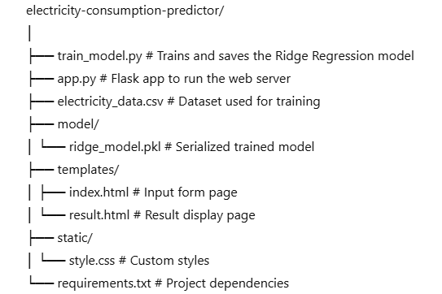
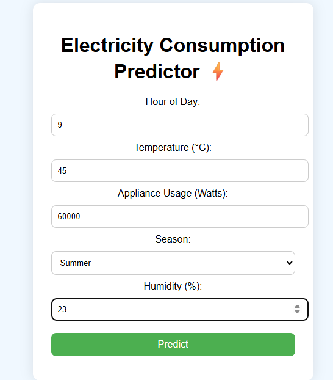
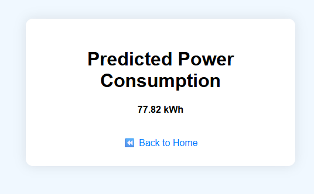

# Electricity Consumption Predictor

This project is a real-time web application that predicts electricity consumption (in kWh) based on various environmental and usage-related inputs. It is built using Python, Flask for the backend, Ridge Regression as the machine learning model, and HTML/CSS for a user-friendly interface.

## Features

- Predicts electricity usage based on:
  - Hour of the day
  - Temperature
  - Appliance usage
  - Season
  - Humidity
- Ridge Regression Model
- Real-time prediction via a web interface
- Clean UI for input and result pages

## Technologies Used

- Python
- Flask
- Pandas, NumPy, Scikit-learn
- Ridge Regression
- HTML, CSS (custom styling)

## Dataset

The dataset is a manually created mock dataset containing:
- Hour (0–23)
- Temperature (in Celsius)
- Appliance usage (in hours)
- Season (encoded)
- Humidity (in %)
- Electricity Consumption (in kWh, target)

This dataset is located in the root directory as `electricity_data.csv`.

## File Structure

## How to Run

1. Install Dependencies
   
   pip install -r requirements.txt

2. Train the Model

    python train_model.py

3. Run the Application

   python app.py
   Open in Browser

   Navigate to http://localhost:5000 to use the app.

## Requirements
    Python 3.7+ 
    Flask
    Pandas
    NumPy
    Scikit-learn

## UI Previwe
Input Page – Enter hour, temperature, appliance usage, season, and humidity.

Output Page – Displays the predicted electricity consumption in kWh.

Author
Developed by R.DHARANI SRI
